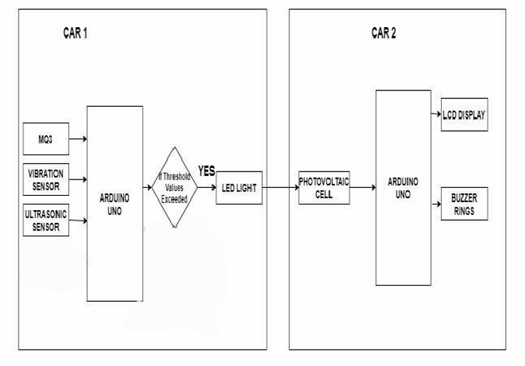
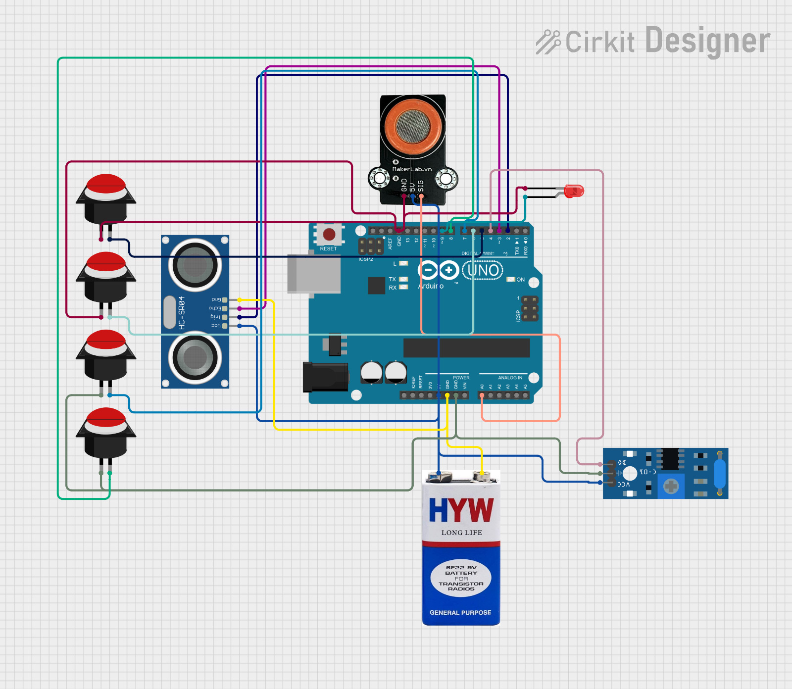
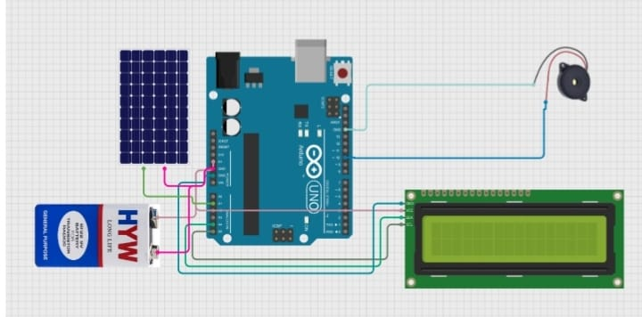

# LiFiGuard – Vehicle Communication and Safety System

## Overview
LiFiGuard is a vehicle-to-vehicle communication system that uses **LiFi (Light Fidelity)** technology to transmit real-time safety alerts between vehicles.

The system detects dangerous conditions such as **obstacles, collisions, and alcohol presence**, and communicates warnings to nearby vehicles using **LED-based LiFi communication**.

This project demonstrates how **visible light communication** can improve road safety using **embedded systems and Arduino**.

---

## Key Features

- Obstacle detection using **Ultrasonic Sensor**
- Collision detection using **Vibration Sensor**
- Alcohol detection using **MQ-3 Gas Sensor**
- Real-time **vehicle-to-vehicle alert communication**
- **LCD display** for driver alerts
- **Buzzer notifications** for critical warnings

---

## Technologies Used

- Arduino Uno
- LiFi Communication
- Embedded C / Arduino Programming
- Ultrasonic Sensor (HC-SR04)
- MQ-3 Gas Sensor
- Vibration Sensor
- LCD Display (16x2 I2C)
- Solar Panel LiFi Receiver
- LEDs for LiFi Transmission

---

## System Architecture

The system consists of two modules:

**Transmitter Vehicle**
- Detects hazards using sensors
- Sends encoded alert messages using LiFi LED

**Receiver Vehicle**
- Receives LiFi signal using solar panel
- Decodes the message
- Displays alerts on LCD and activates buzzer

---

## Transmitter Circuit

## Receiver Circuit

## Hardware Setup

[View Project Setup Image](Images/setup.png)

---

## Transmitter Module

[View Transmitter Image](Images/Transmitter.jpg)

Components:
- Arduino Uno
- Ultrasonic Sensor
- MQ-3 Gas Sensor
- Vibration Sensor
- Control Buttons
- LED (LiFi transmitter)

---

## Receiver Module

[View Receiver Image](Images/receiver.png)

Components:
- Arduino Uno
- Solar Panel (LiFi receiver)
- 16x2 LCD Display
- Buzzer

---

## Project Structure

LiFiGuard-Vehicle-Safety-System
│
├── README.md
├── LIFIGUARD_report.pdf
├── LIFIGUARD_presentation.pdf
│
├── Code
│   ├── transmitter_code.ino
│   └── receiver_code.ino
│
├── Images
│   ├── setup.png
│   ├── Transmitter.jpg
│   └── receiver.png
│
├── Diagrams
│   ├── System_architecture.png
│   ├── Transmitter_circuit.jpeg
│   └── Receiver_circuit.jpeg
│
└── Videos
    └── demo.mp4

---

## How the System Works

1. Sensors detect conditions such as **obstacles, collision, or alcohol presence**.
2. Arduino processes the sensor data.
3. Data is encoded and transmitted using **LiFi LED light**.
4. The receiver solar panel detects the light signal.
5. The receiver Arduino decodes the signal.
6. Alerts are displayed on the **LCD screen**.
7. The **buzzer activates** for critical warnings.

---

## Demonstration

Watch the working demo:

[Open Demo Video](Videos/demo.mp4)

---

## Contributors

- Karthikeya
- Ram Charan
- Shravani
- Haritha
- Madhava Rao
